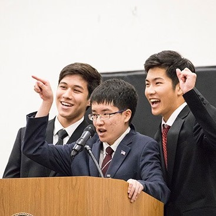

Many people often wonder what exactly a proconsul is when I tell them the title of the position I held in student government. At my school, each grade level from seventh to twelfth has four class officers: a secretary, treasurer, vice president, and president. The position of proconsul is held by three individuals and they oversee all of the student body while working directly with the student activities advisors. This is the highest position that you could run for in student government, and I won it. 

The campaign for proconsul is unique. Once a year in the spring semester a mandatory assembly is held where all upper school students (grades 7-12) get to listen to the proconsul candidates’ speeches. Many students actually look forward to this assembly because in the attempt to win over the opinion of hundreds of teenagers, proconsuls often make their speeches entertaining. I knew that when I ran I would have to make people laugh, but I also knew that I was no stand up comedian. I wrote draft after draft for over a week before I landed on my final speech. After talking over my ideas with my brother who had recently graduated from the same high school I finally produced my end script. I was involved in many different aspects of my high school. From music, to sports, and even to art I knew many of the different groups of people around campus and they also knew me. I decided that the best way to present myself was to just be myself. I would not attempt to manufacture a persona or gimmick for myself just to try and get more laughs out of the student body. So I wrote a script that stayed true to my identity while weaving my own sense of humor into my words in a way that students from all different backgrounds and interests could understand. Delivering that speech in front of the whole school is still one of my proudest moments in memory. 

After winning the election, the real work began. I had weekly meetings with the other proconsuls and our advisors. One of the first tasks we had was to select members for our various student committees. Each proconsul was responsible for three committees. Every committee is made up of about eight students and is dedicated to different student activities such as faculty relations, publicity, or school spirit. We decided on the members of all of the committees together. Even though I was not originally very close to the other proconsuls we eventually grew close to each other. I consider the three of us to be very different from each other but we quickly got to know one another. More importantly, we figured out how to work together while understanding our differences. Together we wrote many speeches, spoke at several assemblies, and ran a number of student events.    

I loved my time as a proconsul and I learned a lot about what it means to be a leader. A leader must understand the wants and needs of the people that he or she is serving. A leader must know how to work as a team with other leaders despite any differences. A leader must know how to adapt and manage groups of people. These are all lessons that I will carry forward with me as I hope to find myself in more leadership roles. 
