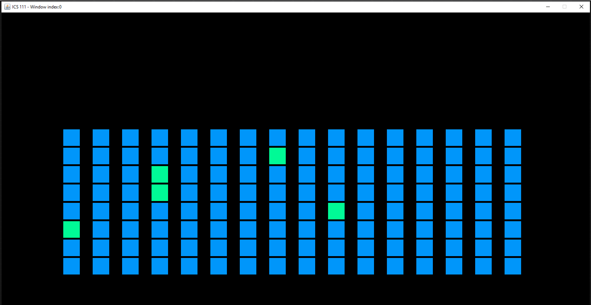

In ICS 111, my first computer science course at the University of Hawai’i at Manoa, our instructor gave us the task of producing a group project in Eclipse (a Java IDE) for one of our final assessments. Rather than create some type of video game like many of the other groups in our class opted to do, we decided to create a drum machine or soundboard. 

Our group wanted to be original, but we quickly ran into both coding. I was in charge of coding the visual display of the soundboard and the user interaction. What proved to be more difficult than we thought was programming in a timer for the sounds being played. The library that we were utilizing in the course did not provide us with any convenient tools to solve this issue so we had to communicate back and forth to find a creative solution. 

As much as I learned from the actual coding of this assignment, I feel strongly that I learned even more about what it is like to collaborate on a project with other programmers. Communication played a large part in our ability to complete this assignment. I was fortunate to have very flexible and understanding partners as we learned together how to cooperate while we were not all physically with each other. We had to figure out the best way to work on the project individually while also being able to save our version history so that we could see what everyone else was adding. After many phone calls, emails, and text messages, I am very proud of what we were able to accomplish for our first ever team project.

Source: <a href="https://github.com/fredstraub/soundboard"><i class="large github icon"></i>theVacay/vacay</a>

