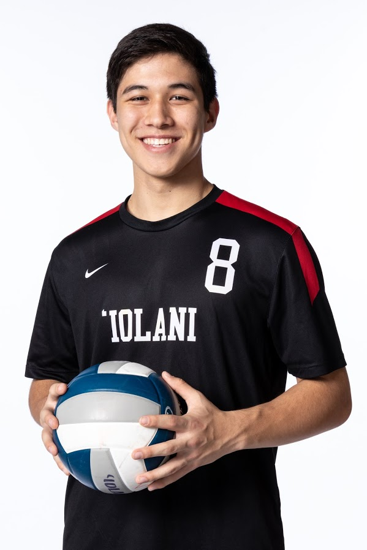

When I first began volleyball for the first time in the seventh grade, I could only dream that I would one day get the chance to play for the varsity team. This finally became a reality during my senior year of high school. 

I will forever remember that varsity team as the best athletic team that I have been a part of and not just because of the success that we achieved. That season taught me what it truly looked like to be a part of a team where each and every member played a role. I was by no means a superstar and I actually did not see that much court time either. My coaches however told me upon my arrival on the team that I had earned my way onto the team by working my way up through the volleyball program. Due to my position in student government outside of volleyball, my coaches told me that I could bring a unique type of leadership to the team. They told me to challenge the starters in my position to push them to be even better. While some people may see that conversation as me being simply benched, I was actually amazed. I have been on teams before where coaches practically divided the team in half in terms of treatment: starters vs. bench players. That was not the case with my volleyball coaches. They treated me respectfully and not as a starter or bench player. They treated me as a member of the team and they truly believed that I had an important role to play. 

Our team strongly followed the leadership of our coaches. We embodied our school’s “One team” motto and made history because of it. We won the HBVI tournament that our school hosted annually and continued on to dethrone our rivals for the league title thus ending a fourteen year drought. This qualified us for the state tournament where we went all the way to the finals. Even though we fell slightly short, this was the first time that our school had placed second in a state championship in a long while. It was an incredible way to end a six year journey.
